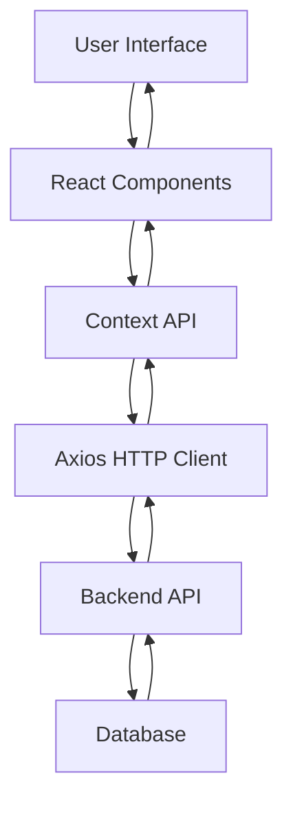

# Configuration Technique - Système de Gestion LJMDI

## 📋 Table des Matières
1. [Architecture Détaillée](#architecture-détaillée)
2. [Configuration des Composants](#configuration-des-composants)
3. [Gestion d'État](#gestion-détat)
4. [Sécurité et Authentification](#sécurité-et-authentification)
5. [API et Communication](#api-et-communication)
6. [Base de Données](#base-de-données)
7. [Optimisations](#optimisations)
8. [Tests et Qualité](#tests-et-qualité)

---

## 🏗️ Architecture Détaillée

### Structure de l'Application React

```
LJMDI/
├── public/
│   ├── index.html          # Template HTML principal
│   └── manifest.json       # Configuration PWA
├── src/
│   ├── components/         # Composants réutilisables
│   ├── contexts/           # Contextes React (État global)
│   ├── pages/              # Pages principales
│   ├── utils/              # Utilitaires et helpers
│   ├── styles/             # Styles globaux
│   ├── App.js              # Composant racine
│   └── index.js            # Point d'entrée
├── package.json            # Dépendances et scripts
├── .env                    # Variables d'environnement
└── README.md               # Documentation principale
```

### Flux de Données



---

## ⚙️ Configuration des Composants

### 1. Composant App (App.js)
```javascript
import React from 'react';
import { BrowserRouter as Router, Routes, Route } from 'react-router-dom';
import { ThemeProvider, createTheme } from '@mui/material/styles';
import { AuthProvider } from './contexts/AuthContext';
import Layout from './components/Layout';
import ProtectedRoute from './components/ProtectedRoute';

// Configuration du thème Material-UI
const theme = createTheme({
    palette: {
        primary: { main: '#1976d2' },
        secondary: { main: '#dc004e' },
        background: { default: '#f5f5f5' }
    },
    typography: {
        fontFamily: '"Roboto", "Helvetica", "Arial", sans-serif'
    }
});

function App() {
    return (
        <ThemeProvider theme={theme}>
            <AuthProvider>
                <Router>
                    <Routes>
                        <Route path="/login" element={<Login />} />
                        <Route path="/" element={<ProtectedRoute><Layout /></ProtectedRoute>}>
                            {/* Routes protégées */}
                        </Route>
                    </Routes>
                </Router>
            </AuthProvider>
        </ThemeProvider>
    );
}
```

### 2. Layout Component (Layout.js)
```javascript
const Layout = () => {
    const [mobileOpen, setMobileOpen] = useState(false);
    const { user, logout, hasPermission } = useAuth();

    const menuItems = [
        { text: 'Dashboard', icon: <DashboardIcon />, path: '/dashboard' },
        { text: 'Membres', icon: <PeopleIcon />, path: '/membres', permission: 'membres' },
        { text: 'Contributions', icon: <AccountBalanceIcon />, path: '/contributions', permission: 'contributions' },
        // ... autres éléments de menu
    ];

    return (
        <Box sx={{ display: 'flex' }}>
            <AppBar position="fixed">
                {/* Header avec navigation */}
            </AppBar>
            <Drawer variant="permanent">
                {/* Sidebar avec menu */}
            </Drawer>
            <Box component="main">
                <Outlet /> {/* Contenu des pages */}
            </Box>
        </Box>
    );
};
```

---

## 🔄 Gestion d'État

### AuthContext (AuthContext.js)
```javascript
import { createContext, useContext, useState, useEffect } from 'react';
import axios from 'axios';

const AuthContext = createContext();

export const AuthProvider = ({ children }) => {
    const [user, setUser] = useState(null);
    const [loading, setLoading] = useState(true);
    const [token, setToken] = useState(localStorage.getItem('token'));

    // Vérification automatique du token
    useEffect(() => {
        if (token) {
            verifyToken();
        } else {
            setLoading(false);
        }
    }, [token]);

    const verifyToken = async () => {
        try {
            const response = await axios.get('/api/auth/verify', {
                headers: { Authorization: `Bearer ${token}` }
            });
            setUser(response.data.user);
        } catch (error) {
            logout();
        } finally {
            setLoading(false);
        }
    };

    const login = async (email, password) => {
        try {
            const response = await axios.post('/api/auth/login', {
                email, password
            });

            const { token: newToken, user: userData } = response.data;
            localStorage.setItem('token', newToken);
            setToken(newToken);
            setUser(userData);
            return { success: true };
        } catch (error) {
            return {
                success: false,
                error: error.response?.data?.message || 'Erreur de connexion'
            };
        }
    };

    const logout = () => {
        localStorage.removeItem('token');
        setToken(null);
        setUser(null);
    };

    // Contrôle d'accès basé sur les rôles
    const hasPermission = (permission) => {
        if (!user) return false;

        const rolePermissions = {
            'Administrateur': ['all'],
            'Président': ['all'],
            'Secrétaire Général': ['membres', 'documents', 'activites', 'rapports'],
            'Trésorier': ['contributions', 'transactions', 'rapports'],
            'Chargé de Discipline': ['presences', 'activites'],
            'Membre': ['profil', 'contributions_own']
        };

        const userPermissions = rolePermissions[user.role] || [];
        return userPermissions.includes('all') || userPermissions.includes(permission);
    };

    const value = {
        user,
        login,
        logout,
        loading,
        hasPermission,
        isAuthenticated: !!user
    };

    return (
        <AuthContext.Provider value={value}>
            {children}
        </AuthContext.Provider>
    );
};

export const useAuth = () => {
    const context = useContext(AuthContext);
    if (!context) {
        throw new Error('useAuth must be used within an AuthProvider');
    }
    return context;
};
```

---

## 🔐 Sécurité et Authentification

### Configuration Axios
```javascript
import axios from 'axios';

// Configuration de base
axios.defaults.baseURL = process.env.REACT_APP_API_URL || 'http://localhost:3001';

// Intercepteur pour ajouter le token automatiquement
axios.interceptors.request.use(
    (config) => {
        const token = localStorage.getItem('token');
        if (token) {
            config.headers.Authorization = `Bearer ${token}`;
        }
        return config;
    },
    (error) => {
        return Promise.reject(error);
    }
);

// Intercepteur pour gérer les erreurs
axios.interceptors.response.use(
    (response) => response,
    (error) => {
        if (error.response?.status === 401) {
            // Token expiré ou invalide
            localStorage.removeItem('token');
            window.location.href = '/login';
        }
        return Promise.reject(error);
    }
);
```

### Protection des Routes
```javascript
const ProtectedRoute = ({ children }) => {
    const { isAuthenticated, loading } = useAuth();

    if (loading) {
        return (
            <Box display="flex" justifyContent="center" alignItems="center" minHeight="100vh">
                <CircularProgress />
            </Box>
        );
    }

    return isAuthenticated ? children : <Navigate to="/login" replace />;
};
```

### Validation des Permissions
```javascript
// Dans chaque composant
const { hasPermission } = useAuth();

// Exemple d'utilisation
{hasPermission('membres') && (
    <Button onClick={handleAddMember}>
        Ajouter un Membre
    </Button>
)}
```

---

## 🌐 API et Communication

### Service API Générique
```javascript
// services/api.js
import axios from 'axios';

const API_BASE_URL = process.env.REACT_APP_API_URL;

class ApiService {
    constructor() {
        this.client = axios.create({
            baseURL: API_BASE_URL,
            headers: {
                'Content-Type': 'application/json'
            }
        });
    }

    // Méthodes génériques
    async get(endpoint) {
        try {
            const response = await this.client.get(endpoint);
            return response.data;
        } catch (error) {
            throw this.handleError(error);
        }
    }

    async post(endpoint, data) {
        try {
            const response = await this.client.post(endpoint, data);
            return response.data;
        } catch (error) {
            throw this.handleError(error);
        }
    }

    async put(endpoint, data) {
        try {
            const response = await this.client.put(endpoint, data);
            return response.data;
        } catch (error) {
            throw this.handleError(error);
        }
    }

    async delete(endpoint) {
        try {
            const response = await this.client.delete(endpoint);
            return response.data;
        } catch (error) {
            throw this.handleError(error);
        }
    }

    handleError(error) {
        if (error.response) {
            return {
                message: error.response.data.message || 'Erreur serveur',
                status: error.response.status
            };
        } else if (error.request) {
            return {
                message: 'Erreur de connexion',
                status: 0
            };
        } else {
            return {
                message: 'Erreur inconnue',
                status: -1
            };
        }
    }
}

export default new ApiService();
```

### Services Spécialisés
```javascript
// services/membresService.js
import apiService from './api';

export const membresService = {
    getAll: () => apiService.get('/api/membres'),
    getById: (id) => apiService.get(`/api/membres/${id}`),
    create: (data) => apiService.post('/api/membres', data),
    update: (id, data) => apiService.put(`/api/membres/${id}`, data),
    delete: (id) => apiService.delete(`/api/membres/${id}`)
};

// services/contributionsService.js
export const contributionsService = {
    getAll: () => apiService.get('/api/contributions'),
    getByMember: (memberId) => apiService.get(`/api/contributions/member/${memberId}`),
    create: (data) => apiService.post('/api/contributions', data),
    update: (id, data) => apiService.put(`/api/contributions/${id}`, data),
    delete: (id) => apiService.delete(`/api/contributions/${id}`)
};
```

---

## 🗄️ Base de Données

### Schéma de Base de Données (MySQL)

```sql
-- Table des utilisateurs/comptes
CREATE TABLE comptes (
    id_compte INT PRIMARY KEY AUTO_INCREMENT,
    email VARCHAR(255) UNIQUE NOT NULL,
    mot_de_passe VARCHAR(255) NOT NULL,
    role ENUM('Administrateur', 'Président', 'Secrétaire Général', 'Trésorier', 'Chargé de Discipline', 'Membre') NOT NULL,
    actif BOOLEAN DEFAULT TRUE,
    date_creation TIMESTAMP DEFAULT CURRENT_TIMESTAMP,
    derniere_connexion TIMESTAMP NULL
);

-- Table des membres
CREATE TABLE membres (
    id_membre INT PRIMARY KEY AUTO_INCREMENT,
    nom VARCHAR(100) NOT NULL,
    prenom VARCHAR(100) NOT NULL,
    email VARCHAR(255) UNIQUE NOT NULL,
    telephone VARCHAR(20),
    date_adhesion DATE NOT NULL,
    statut ENUM('Actif', 'Inactif', 'Régulier') DEFAULT 'Actif',
    adresse TEXT,
    profession VARCHAR(100),
    id_compte INT,
    FOREIGN KEY (id_compte) REFERENCES comptes(id_compte)
);

-- Table des contributions
CREATE TABLE contributions (
    id_contribution INT PRIMARY KEY AUTO_INCREMENT,
    id_membre INT NOT NULL,
    type_cotisation ENUM('Hebdomadaire', 'Spéciale', 'Annuelle') NOT NULL,
    montant DECIMAL(10,2) NOT NULL,
    date_paiement DATE NOT NULL,
    statut_paiement ENUM('Payé', 'En Retard', 'En Attente') DEFAULT 'En Attente',
    date_creation TIMESTAMP DEFAULT CURRENT_TIMESTAMP,
    FOREIGN KEY (id_membre) REFERENCES membres(id_membre)
);

-- Table des activités
CREATE TABLE activites (
    id_activite INT PRIMARY KEY AUTO_INCREMENT,
    titre VARCHAR(200) NOT NULL,
    type_activite ENUM('Réunion', 'Séminaire', 'Formation', 'Événement', 'Assemblée', 'Autre') NOT NULL,
    description TEXT,
    date_debut DATETIME NOT NULL,
    date_fin DATETIME NOT NULL,
    lieu VARCHAR(200),
    statut ENUM('Planifiée', 'En Cours', 'Terminée', 'Annulée') DEFAULT 'Planifiée',
    date_creation TIMESTAMP DEFAULT CURRENT_TIMESTAMP
);

-- Table des présences
CREATE TABLE presences (
    id_presence INT PRIMARY KEY AUTO_INCREMENT,
    id_activite INT NOT NULL,
    id_membre INT NOT NULL,
    statut ENUM('Présent', 'Absent', 'Retard') NOT NULL,
    date_heure DATETIME NOT NULL,
    remarques TEXT,
    FOREIGN KEY (id_activite) REFERENCES activites(id_activite),
    FOREIGN KEY (id_membre) REFERENCES membres(id_membre)
);

-- Table des documents
CREATE TABLE documents (
    id_document INT PRIMARY KEY AUTO_INCREMENT,
    nom_fichier VARCHAR(255) NOT NULL,
    type_document ENUM('Rapport', 'PV', 'Règlement', 'Communication', 'Autre') NOT NULL,
    chemin_fichier VARCHAR(500) NOT NULL,
    taille_fichier INT,
    description TEXT,
    date_creation TIMESTAMP DEFAULT CURRENT_TIMESTAMP
);

-- Table des cas sociaux
CREATE TABLE cas_sociaux (
    id_cas INT PRIMARY KEY AUTO_INCREMENT,
    id_membre INT NOT NULL,
    type_cas ENUM('Maladie', 'Décès', 'Accident', 'Mariage', 'Naissance', 'Autre') NOT NULL,
    description TEXT NOT NULL,
    statut ENUM('Ouvert', 'En Cours', 'Résolu', 'Fermé') DEFAULT 'Ouvert',
    date_creation TIMESTAMP DEFAULT CURRENT_TIMESTAMP,
    FOREIGN KEY (id_membre) REFERENCES membres(id_membre)
);

-- Table des assistances
CREATE TABLE assistances (
    id_assistance INT PRIMARY KEY AUTO_INCREMENT,
    id_cas INT NOT NULL,
    montant DECIMAL(10,2) NOT NULL,
    type_assistance ENUM('Financière', 'Matérielle', 'Médicale', 'Autre') NOT NULL,
    description TEXT,
    date_assistance DATE NOT NULL,
    statut ENUM('En Attente', 'Approuvée', 'Refusée', 'Versée') DEFAULT 'En Attente',
    FOREIGN KEY (id_cas) REFERENCES cas_sociaux(id_cas)
);
```

### Index et Optimisations
```sql
-- Index pour améliorer les performances
CREATE INDEX idx_membres_email ON membres(email);
CREATE INDEX idx_contributions_membre ON contributions(id_membre);
CREATE INDEX idx_contributions_date ON contributions(date_paiement);
CREATE INDEX idx_presences_activite ON presences(id_activite);
CREATE INDEX idx_presences_membre ON presences(id_membre);
CREATE INDEX idx_cas_membre ON cas_sociaux(id_membre);
```

---

## ⚡ Optimisations

### Lazy Loading
```javascript
import { lazy, Suspense } from 'react';

// Chargement paresseux des composants
const Dashboard = lazy(() => import('./pages/Dashboard'));
const Membres = lazy(() => import('./pages/Membres'));
const Contributions = lazy(() => import('./pages/Contributions'));

// Utilisation avec Suspense
<Suspense fallback={<CircularProgress />}>
    <Routes>
        <Route path="/dashboard" element={<Dashboard />} />
        <Route path="/membres" element={<Membres />} />
        <Route path="/contributions" element={<Contributions />} />
    </Routes>
</Suspense>
```

### Mémorisation des Composants
```javascript
import { memo, useMemo, useCallback } from 'react';

// Composant mémorisé
const StatCard = memo(({ title, value, icon, color }) => {
    return (
        <Card>
            <CardContent>
                <Typography variant="h6">{title}</Typography>
                <Typography variant="h4">{value}</Typography>
            </CardContent>
        </Card>
    );
});

// Calculs mémorisés
const Dashboard = () => {
    const { stats } = useAuth();
    
    const processedStats = useMemo(() => {
        return {
            totalMembers: stats?.membresActifs || 0,
            totalContributions: stats?.tresorerie || 0,
            // ... autres calculs
        };
    }, [stats]);

    const handleRefresh = useCallback(() => {
        // Logique de rafraîchissement
    }, []);

    return (
        <Box>
            {/* Contenu du dashboard */}
        </Box>
    );
};
```

### Gestion des États de Chargement
```javascript
const Membres = () => {
    const [membres, setMembres] = useState([]);
    const [loading, setLoading] = useState(true);
    const [error, setError] = useState('');

    useEffect(() => {
        fetchMembres();
    }, []);

    const fetchMembres = async () => {
        try {
            setLoading(true);
            setError('');
            const data = await membresService.getAll();
            setMembres(data);
        } catch (error) {
            setError('Erreur lors du chargement des membres');
        } finally {
            setLoading(false);
        }
    };

    if (loading) {
        return (
            <Box display="flex" justifyContent="center" alignItems="center" minHeight="400px">
                <CircularProgress />
            </Box>
        );
    }

    if (error) {
        return <Alert severity="error">{error}</Alert>;
    }

    return (
        <Box>
            {/* Contenu principal */}
        </Box>
    );
};
```

---

## 🧪 Tests et Qualité

### Configuration Jest
```javascript
// package.json
{
  "scripts": {
    "test": "react-scripts test",
    "test:coverage": "react-scripts test --coverage"
  },
  "jest": {
    "collectCoverageFrom": [
      "src/**/*.{js,jsx}",
      "!src/index.js",
      "!src/reportWebVitals.js"
    ]
  }
}
```

### Tests de Composants
```javascript
// __tests__/AuthContext.test.js
import { render, screen, act } from '@testing-library/react';
import { AuthProvider } from '../contexts/AuthContext';

describe('AuthContext', () => {
    test('should provide authentication context', () => {
        render(
            <AuthProvider>
                <div>Test Component</div>
            </AuthProvider>
        );
        
        expect(screen.getByText('Test Component')).toBeInTheDocument();
    });
});
```

### Tests d'Intégration
```javascript
// __tests__/Login.test.js
import { render, screen, fireEvent, waitFor } from '@testing-library/react';
import { BrowserRouter } from 'react-router-dom';
import Login from '../pages/Login';
import { AuthProvider } from '../contexts/AuthContext';

const renderWithProviders = (component) => {
    return render(
        <BrowserRouter>
            <AuthProvider>
                {component}
            </AuthProvider>
        </BrowserRouter>
    );
};

describe('Login Component', () => {
    test('should render login form', () => {
        renderWithProviders(<Login />);
        
        expect(screen.getByLabelText('Adresse Email')).toBeInTheDocument();
        expect(screen.getByLabelText('Mot de Passe')).toBeInTheDocument();
        expect(screen.getByRole('button', { name: 'Se Connecter' })).toBeInTheDocument();
    });
});
```

### ESLint Configuration
```javascript
// .eslintrc.js
module.exports = {
    extends: [
        'react-app',
        'react-app/jest'
    ],
    rules: {
        'no-unused-vars': 'warn',
        'no-console': 'warn',
        'prefer-const': 'error',
        'no-var': 'error'
    }
};
```

---

## 📊 Monitoring et Performance

### Web Vitals
```javascript
// reportWebVitals.js
import { getCLS, getFID, getFCP, getLCP, getTTFB } from 'web-vitals';

function sendToAnalytics(metric) {
    // Envoyer les métriques à votre service d'analytics
    console.log(metric);
}

getCLS(sendToAnalytics);
getFID(sendToAnalytics);
getFCP(sendToAnalytics);
getLCP(sendToAnalytics);
getTTFB(sendToAnalytics);
```

### Error Boundary
```javascript
class ErrorBoundary extends React.Component {
    constructor(props) {
        super(props);
        this.state = { hasError: false, error: null };
    }

    static getDerivedStateFromError(error) {
        return { hasError: true, error };
    }

    componentDidCatch(error, errorInfo) {
        console.error('Error caught by boundary:', error, errorInfo);
        // Envoyer l'erreur à un service de monitoring
    }

    render() {
        if (this.state.hasError) {
            return (
                <Box p={3}>
                    <Alert severity="error">
                        Une erreur s'est produite. Veuillez rafraîchir la page.
                    </Alert>
                </Box>
            );
        }

        return this.props.children;
    }
}
```

---

**© 2024 LJMDI - Configuration Technique du Système de Gestion**
